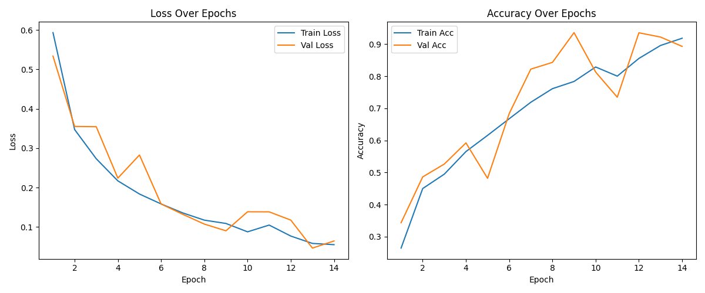
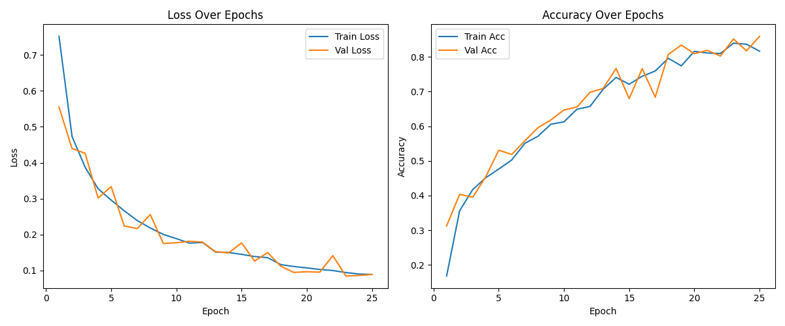

# Simple-CNN-Model

This project presents a minimalistic implementation of a convolutional neural network (CNN) for the task of image classification. The model provides a basic architecture and tools for training and testing.

## Preparing the dataset
To work with the model, you need to prepare the data as follows:
- Create a folder structure where each folder is named after the class name and has corresponding images inside.
- Run the `dataset_spliter.py` script to automatically split the data into training and validation sets.

## Model Architectures
This project contains two different convolutional neural network architectures:

### 1. CNNClassifier — Standard CNN
A conventional CNN architecture with 3 convolutional layers, batch normalization, max pooling, dropout, and fully connected layers.

**Advantages:**
- Simple and effective for baseline tasks
- High capacity for feature extraction
- Architecture Highlights:
- Convolutions: 3×Conv2D (1→32→64→128)
- Fully Connected: Linear(128 → 256 → num_classes)
- Regularization: Dropout (0.3)
- Pooling: MaxPool2D + AdaptiveAvgPool2D

### 2. LightCNNClassifier — Lightweight CNN with Attention
An optimized and lightweight version using depthwise separable convolutions and Squeeze-and-Excitation (SE) blocks to reduce computational complexity while retaining performance.

**Advantages:**
- Fewer parameters, faster inference
- Built-in attention via SE blocks
- Good for deployment on edge devices or mobile
- Architecture Highlights:
- Separable Convolutions: 1→32→64→128
- SE Blocks: channel-wise attention after each convolution block
- Global Average Pooling instead of FC layer stack
- Dropout: 0.2

## How to start learning

To train one of the models, run:
```bash
python train.py --model cnn         # for CNNClassifier
python train.py --model lightcnn    # for LightCNNClassifier
```
The model will be saved in `.pth` format for later use.

## Visualization of the training process
During training, a graph of the change in the loss function and accuracy for the training and validation samples is generated:
### CNN Training Curves:
<div align="center"> 
   
</div>

### LightCNN Training Curves:
<div align="center"> 
   
</div>

## Model Checking Tools
### 1. Checking on Single Images
To quickly check a model on a single image, use:

```bash
python predict.py --image "path/to/image.jpg" --model "path/to/model.pth"
```
### 2. Bulk testing
To evaluate the quality of the model on a large dataset:
- Prepare the test dataset:
  - Create a folder with test images
  - Create a labels.csv file with a match between file names and their true labels
- Run the testing script:

```bash
python test_model.py
```

## Dependencies
Install all required dependencies:
- For GPU:
  ```bash
  pip install -r requirements-gpu.txt
  ```
- For CPU:
  ```bash
  pip install -r requirements-cpu.txt
  ```
